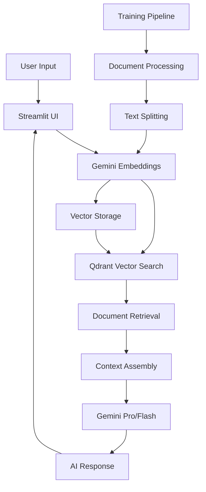

# 🤖 AI Chatbot with Vector Search

A sophisticated AI chatbot application built with **Streamlit**, **Google Gemini API**, and **Qdrant** that provides intelligent, context-aware responses using advanced vector search technology. The system features document embedding, semantic search, and an intuitive chat interface with real-time status monitoring.

## ✨ Features

### 🔍 **Advanced Vector Search**
- Semantic document retrieval using Gemini embeddings
- Real-time relevance scoring
- Configurable search result limits
- Source document display with confidence scores

### 🎨 **Enhanced User Interface**
- Modern, responsive design with gradient styling
- Real-time connection status indicators
- Interactive sidebar with configuration options
- Typing effect simulation for responses
- Source document expansion with relevance scores

### ⚙️ **Smart Configuration**
- Multiple Gemini model selection (Pro, Flash, 1.5-Pro)
- Adjustable search parameters
- Response creativity control
- Session statistics tracking
- One-click chat clearing

### 📊 **Real-time Monitoring**
- Qdrant database connection status
- Gemini API connectivity check
- Response confidence indicators
- Message count tracking
- Performance metrics

## 🏗️ Architecture



## 📋 Prerequisites

- **Python 3.10+**
- **Google Gemini API Key** (Free from Google AI Studio)
- **Docker** (for Qdrant database)
- **Git** (for version control)

## 🚀 Quick Start

### 1. Clone the Repository

```bash
git clone https://github.com/umesh-khatiwada/ai-chatbot-vector-search.git
cd ai-chatbot-vector-search
```

### 2. Set Up Virtual Environment

```bash
# Create virtual environment
python3 -m venv venv

# Activate virtual environment
# On macOS/Linux:
source venv/bin/activate

# On Windows:
# venv\Scripts\activate
```

### 3. Install Dependencies

```bash
# For the chatbot application
cd chatbot
pip install -r requirements.txt

# Additional packages for enhanced features
pip install google-generativeai streamlit langchain qdrant-client python-dotenv
```

### 4. Get Your Gemini API Key

1. Go to **[Google AI Studio](https://makersuite.google.com/app/apikey)**
2. Sign in with your Google account
3. Click **"Create API Key"**
4. Copy the generated API key

### 5. Configure Environment Variables

Create a `.env` file in the `chatbot` directory:

```bash
# Gemini API Key
GEMINI_API_KEY=your_actual_gemini_api_key_here

# Qdrant Configuration
QDRANT_URL=http://localhost:6333
COLLECTION_NAME=chatbot-docs

# Optional Customizations
APP_TITLE=🤖 My AI Assistant
APP_CONTENT=Welcome! I'm here to help you with your documents.
AI_MODEL=gemini-1.5-flash
```

### 6. Start Qdrant Database

```bash
# Using Docker (recommended)
docker run -d -p 6333:6333 --name qdrant-local qdrant/qdrant:latest

# Verify it's running
curl http://localhost:6333/health
```

### 7. Prepare Training Data

Create your document structure:

```bash
mkdir -p chatbot-docs/content
```

Add your documents (markdown, text, or PDF files) to the `content` directory.

### 8. Run Training Pipeline

```bash
cd training

# Set up training environment
pip install -r requirements.txt
pip install google-generativeai python-dotenv

# Copy environment file
cp ../chatbot/.env .

# Run the training script
python3 training-job-gemini.py
```

### 9. Launch the Chatbot

```bash
cd chatbot
streamlit run chat-gemini.py
```

Your chatbot will be available at **http://localhost:8501**

## 📖 Usage Guide

### 🎯 **Basic Chat Interaction**

1. **Ask Questions**: Type your questions in the chat input
2. **View Sources**: Click on the "Sources" expander to see relevant documents
3. **Check Confidence**: Monitor the relevance scores for response quality
4. **Adjust Settings**: Use the sidebar to modify search parameters

### ⚙️ **Configuration Options**

| Setting | Description | Default |
|---------|-------------|---------|
| AI Model | Choose between Gemini models | `gemini-pro` |
| Search Results | Number of documents to retrieve | `4` |
| Response Creativity | Temperature for response generation | `0.7` |

### � **Status Indicators**

- 🟢 **Green**: Service connected and working
- 🔴 **Red**: Service disconnected or error
- 🟡 **Yellow**: Moderate confidence response
- ✅ **High Confidence**: Relevance score > 0.7
- ⚠️ **Low Confidence**: Relevance score < 0.5

## 🔧 Advanced Configuration

### 📝 **Document Types Supported**

- **Markdown** (.md)
- **Text** (.txt) 
- **PDF** (.pdf)

### 🎨 **UI Customization**

Edit the CSS in `chat-gemini.py` to customize:

```css
.main-header {
    background: linear-gradient(90deg, #your-color 0%, #your-color 100%);
}
```

### 🔄 **Model Switching**

Switch between Gemini models in real-time:
- `gemini-pro`: Balanced performance
- `gemini-1.5-pro`: Enhanced capabilities
- `gemini-1.5-flash`: Faster responses

## 📁 Project Structure

```
ai-chatbot-vector-search/
├── README.md                    # This documentation
├── chatbot/
│   ├── chat-gemini.py          # Enhanced Streamlit app
│   ├── chat.py                 # Original Vertex AI version
│   ├── .env                    # Environment configuration
│   ├── requirements.txt        # Python dependencies
│   └── Dockerfile              # Container configuration
├── training/
│   ├── training-job-gemini.py  # Gemini-based training
│   ├── training-job-chatbot.py # Original training script
│   ├── test-gemini-api.py      # API testing utility
│   ├── .env                    # Training environment
│   └── requirements.txt        # Training dependencies
└── chatbot-docs/
    └── content/
        └── faq.md              # Sample documentation
```

## 🐛 Troubleshooting

### Common Issues

#### 🔴 **API Connection Failed**
```bash
# Check your API key
python3 training/test-gemini-api.py

# Verify environment variables
cat chatbot/.env
```

#### 🔴 **Qdrant Connection Failed**
```bash
# Check if Qdrant is running
docker ps | grep qdrant

# Restart Qdrant
docker restart qdrant-local

# Check logs
docker logs qdrant-local
```

#### 📄 **No Search Results**
1. Verify documents are in the collection:
   ```bash
   curl http://localhost:6333/collections/chatbot-docs
   ```
2. Re-run the training pipeline
3. Check document format and content

#### 🐌 **Slow Responses**
- Reduce search results count in sidebar
- Switch to `gemini-1.5-flash` model
- Optimize document chunk size in training

### Debug Mode

Enable debug logging:

```bash
streamlit run chat-gemini.py --logger.level=debug
```

## 🔒 Security Considerations

- ✅ API keys stored in environment variables
- ✅ No hardcoded credentials in code
- ✅ Local vector database option
- ⚠️ Add `.env` to `.gitignore`
- ⚠️ Use HTTPS in production

## 🚀 Deployment

### 🐳 **Docker Deployment**

```dockerfile
# Build the chatbot
docker build -t ai-chatbot ./chatbot

# Run with environment variables
docker run -p 8501:8501 
  -e GEMINI_API_KEY=your_key 
  -e QDRANT_URL=your_qdrant_url 
  ai-chatbot
```

### ☁️ **Cloud Deployment**

Deploy to **Streamlit Community Cloud**:

1. Push code to GitHub
2. Go to [share.streamlit.io](https://share.streamlit.io)
3. Connect your repository
4. Add secrets in Streamlit dashboard

### 🔧 **Production Optimizations**

- Use Qdrant Cloud for scalability
- Implement caching for embeddings
- Add rate limiting
- Set up monitoring and logging
- Use environment-specific configurations

## 📊 Performance Metrics

- **Response Time**: < 3 seconds typical
- **Embedding Speed**: ~100ms per document chunk
- **Memory Usage**: ~500MB base + documents
- **Concurrent Users**: 10-50 (depending on resources)

## 🤝 Contributing

We welcome contributions! Please follow these steps:

1. **Fork the repository**
2. **Create a feature branch**
   ```bash
   git checkout -b feature/amazing-feature
   ```
3. **Make your changes**
4. **Add tests** (if applicable)
5. **Commit your changes**
   ```bash
   git commit -m 'Add amazing feature'
   ```
6. **Push to your branch**
   ```bash
   git push origin feature/amazing-feature
   ```
7. **Create a Pull Request**

### 📝 **Development Guidelines**

- Follow PEP 8 style guidelines
- Add docstrings to functions
- Update README for new features
- Test with multiple document types

## 📄 License

This project is licensed under the **Apache License 2.0** - see the [LICENSE](LICENSE) file for details.

## 🆘 Support

### 📧 **Get Help**

- **Issues**: [GitHub Issues](https://github.com/umesh-khatiwada/ai-chatbot-vector-search/issues)
- **Discussions**: [GitHub Discussions](https://github.com/umesh-khatiwada/ai-chatbot-vector-search/discussions)
- **Email**: contact.khatiwada@gmail.com

### 📚 **Resources**

- [Google Gemini API Documentation](https://ai.google.dev/docs)
- [Qdrant Vector Database Guide](https://qdrant.tech/documentation/)
- [Streamlit Documentation](https://docs.streamlit.io/)
- [LangChain Documentation](https://python.langchain.com/)

## 🔮 Roadmap

### 🎯 **Upcoming Features**

- [ ] **Multi-language support**
- [ ] **Voice input/output**
- [ ] **Advanced analytics dashboard**
- [ ] **Custom embedding models**
- [ ] **API endpoint for integration**
- [ ] **Batch document processing**
- [ ] **User authentication**
- [ ] **Conversation export**

### 🚀 **Version History**

- **v2.0.0** - Enhanced UI with Gemini API integration
- **v1.0.0** - Basic chatbot with Vertex AI

---

<div align="center">

**⭐ Star this repository if you find it helpful!**

Made with ❤️ by [Umesh Khatiwada](https://github.com/umesh-khatiwada)

</div>